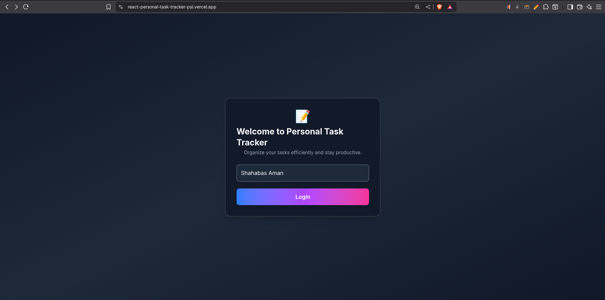
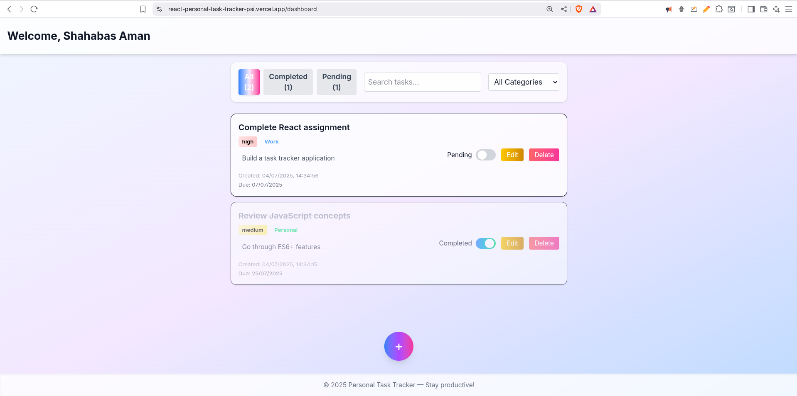
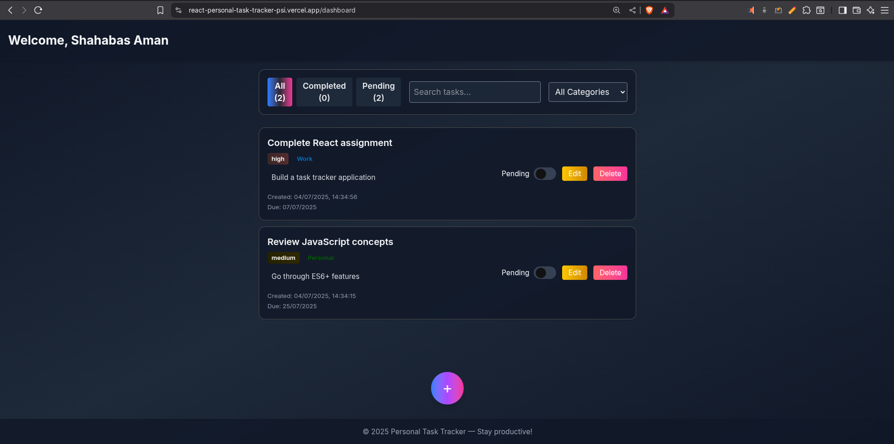
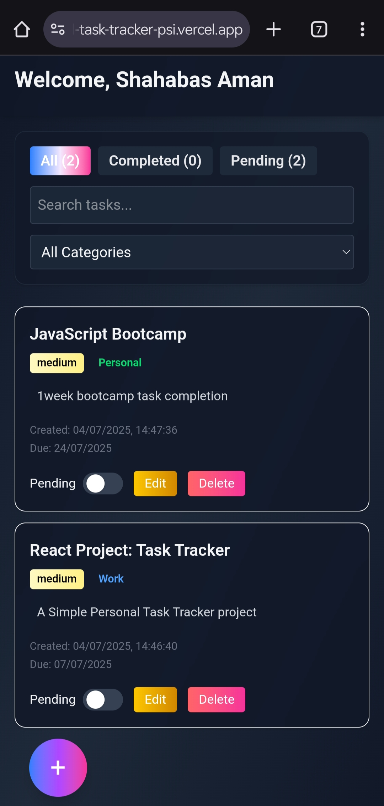

# 📝 Personal Task Tracker

## 📖 Description
Personal Task Tracker is a modern, responsive, and user-friendly web application for managing your daily tasks. Built with React, Vite, and Tailwind CSS, it allows you to add, edit, filter, and organize your tasks efficiently, with a beautiful UI that supports both light and dark modes.

---

## 🚀 Features
- 🔐 **User Login:** Simple username-based login stored in localStorage (no real authentication).
- ➕ **Task Creation:** Add tasks with title, optional description, priority, due date, and category.
- ✅ **Completion Toggle:** Instantly mark tasks as completed or pending with a stylish sliding toggle.
- 🗑 **Task Deletion:** Remove tasks with confirmation.
- ✏️ **Inline Editing:** Edit task details directly from the list.
- 🔍 **Search & Filter:** Filter tasks by status (All, Completed, Pending), category, and search by title/description.
- 📊 **Dynamic Counts:** See real-time counts for each filter.
- 💾 **Persistent Storage:** All data is saved in localStorage and synced with React state.
- 🎨 **Modern UI/UX:** Gradient backgrounds, glassmorphism, and responsive design for mobile and desktop.
- 🌗 **Dark/Light Mode:** Seamless theme switching with a toggle.
- 🧩 **Clean Code:** Modular, reusable components and utilities.

---

## 🛠 Setup Instructions

1. **Clone the repository**
   ```sh
   git clone https://github.com/shahabas07/react-personal-task-tracker.git
   cd personal-task-tracker
   ```
2. **Install dependencies**
   ```sh
   npm install
   ```
3. **Start the development server**
   ```sh
   npm run dev
   ```
4. **Open localhost in your browser**

---

## 🧰 Technologies Used
- [React.js](https://react.dev/) (functional components & hooks)
- [Vite](https://vitejs.dev/) (fast build tool)
- [Tailwind CSS v4](https://tailwindcss.com/) (utility-first CSS)
- [React Router](https://reactrouter.com/) (client-side routing)
- LocalStorage (for data persistence)
- [Framer Motion](https://www.framer.com/motion/) (for smooth animations)

---

## 🔗 Live Demo
[](https://react-personal-task-tracker-psi.vercel.app/)

---

## 🖼 Screenshots

### 🏠 Login Page


### 📋 Dashboard (Light & Dark Mode)





---

> _Stay organized and productive with your personal task tracker!_

---
